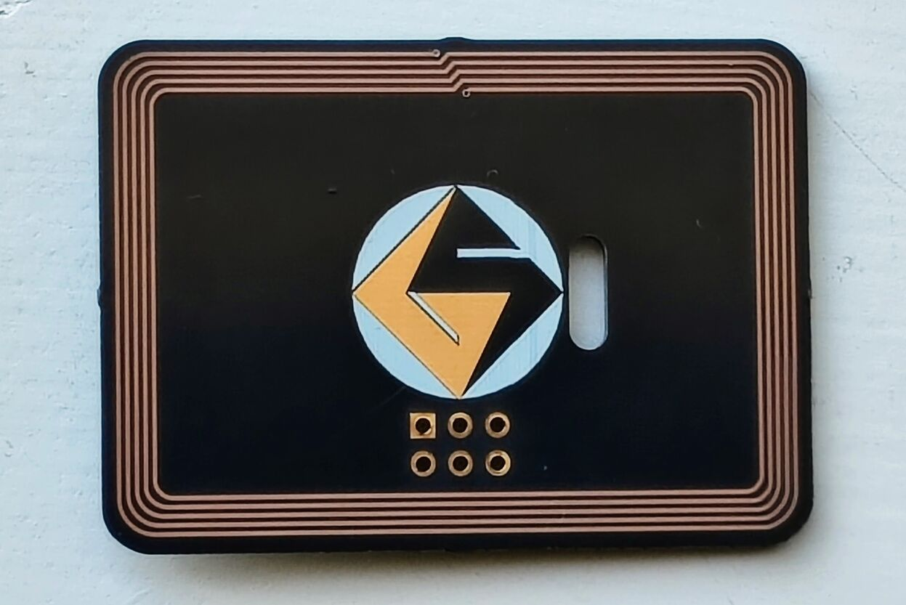
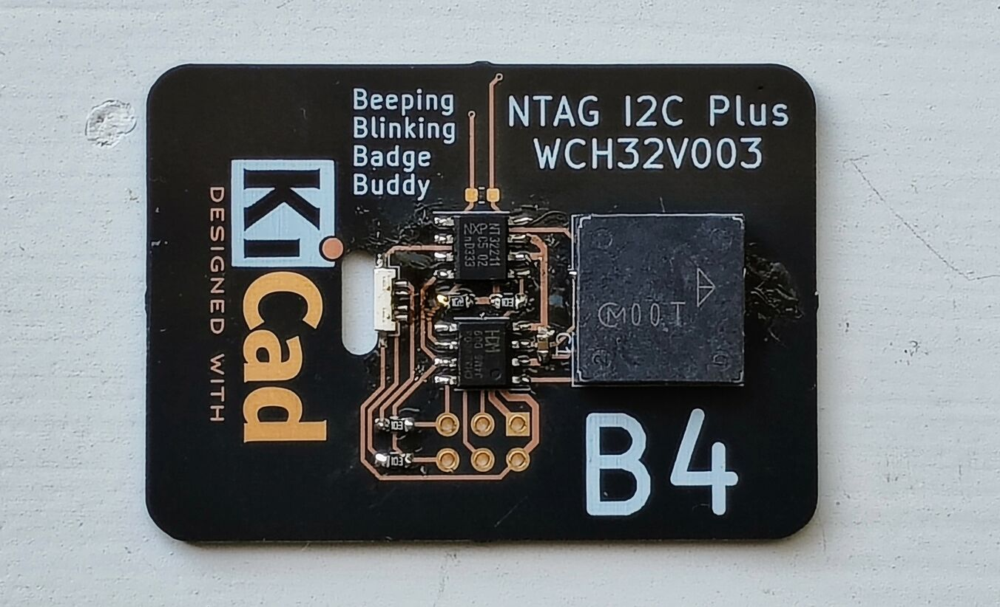

# NFCWCHSAO B4
# Beeping Blinking Badge Buddy

This board has an engergy harvesting NFC EEPROM and WCH CH32V003 MCU.  
The MCU is connected to an RGB LED and piezo buzzer.
The two ICs are 8 pin SOIC, and the passives are 0603 so it is not too dificult to hand assemble, except for the RGB LED that is a little fine pitch, but the pads are extended and the close pins are shorted together anyway so it is not too difficult.

This board is designed for and looks great in OSH Park After Dark

[Order from OSH Park](https://oshpark.com/shared_projects/BUIwWMCI)
Be sure to choose the "After Dark" option to get the same results as in the picture.

## Components
 * [NT3H2211W0FT1X](https://www.mouser.com/ProductDetail/771-NT3H2211W0FT1X) 
 * [CH32V003J4M6](https://www.lcsc.com/product-detail/Microcontroller-Units-MCUs-MPUs-SOCs_WCH-Jiangsu-Qin-Heng-CH32V003J4M6_C5346354.html) 
 * [PKLCS1212E20A0-R1](https://www.mouser.com/ProductDetail/81-PKLCS1212E20A0-R1) 
 * [QLS6A-FKW-CNSNSF043](https://www.mouser.com/ProductDetail/941-QLS6AFKWNSNSF043) 
 * 1.0uF 0603 Capacitor
 * 4x 10K 0603 Resistors

## Schematic
[View Schematic online in KiCanvas](https://kicanvas.org/?github=https%3A%2F%2Fgithub.com%2Fgsteiert%2Fnfcwchsao%2Fblob%2Fmain%2Fbrd%2Fnfcwchsao.kicad_sch)
